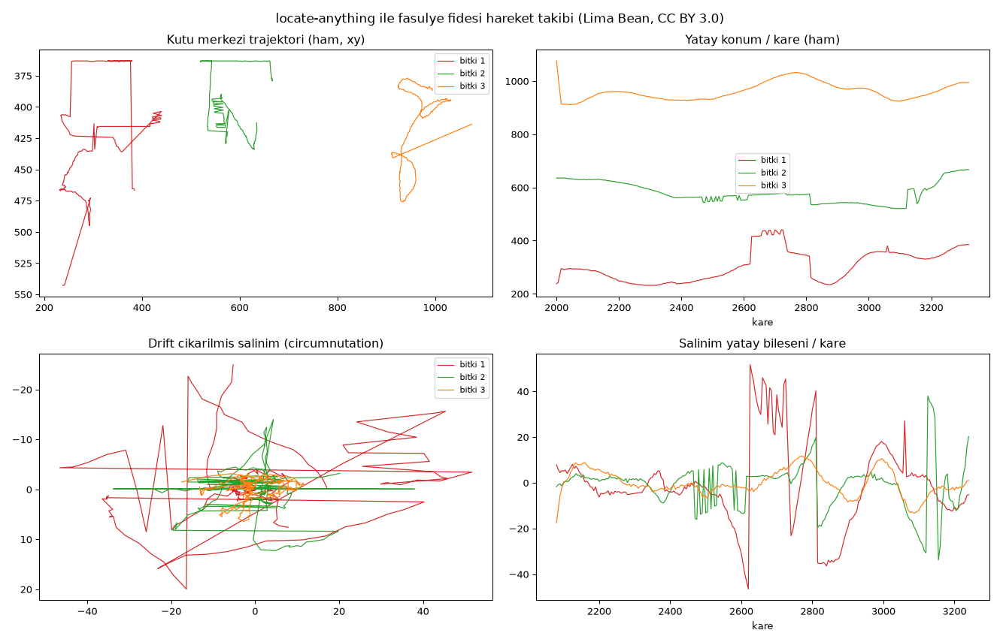

# Plant Motion Tracking — Point-Based Localization with locate-anything

> ## 🚧 Status: WORK IN PROGRESS
> This project is under active development. A working pipeline and validated results exist,
> but the primary goal — capturing **circumnutation** with locate-anything — has not yet
> been fully achieved. Current step: selecting a more suitable time-lapse dataset.
> See the [Roadmap](#roadmap--open-work).

Studying plant movement in time-lapse videos through **point-based localization**, using
[**locate-anything**](https://github.com/mudler/locate-anything.cpp) — a C++/ggml port of
NVIDIA's LocateAnything-3B, an open-vocabulary vision-language detection model.

Conventionally a researcher clicks the plant's tip in every frame by hand. The goal here is
to automate that with a single text prompt (`"seedling"`).

---

## Why this is interesting: mapping a tool's limits

The output of this project is not just "a working tracker" — it is a **measured map of
where locate-anything works and where it does not.** It was tried on two opposite datasets,
and the results differ dramatically:

| Dataset | Image type | Coverage | Outcome |
|---|---|---|---|
| Lima Bean (Wikimedia) | Color, side view, dark background | **92–99%** | ✅ Works |
| Circumnutation Tracker | Grayscale, top view, low contrast | **19–27%** | ❌ Fails |

Because the model was trained on natural images (COCO-style), on the second dataset it
detected not the plants but the **text labels burned into the video**.

---

## How we got here (methodology)

The project did not progress linearly; each step was shaped by the previous step's finding.
This section records that reasoning — it is the most instructive part.

### 1. Start: apply locate-anything to circumnutation data
We had the [Circumnutation Tracker](https://plantmethods.biomedcentral.com/articles/10.1186/1746-4811-10-24)
sample dataset: 757 frames, grayscale, top-down, 16 seedlings, with **hand-annotated ground
truth** (SQLite). Plan: crop each plant → find the tip with locate-anything → track it.

### 2. Finding: the model does not work on this data
- Per-plant crop → **0 detections** (upscaling, CLAHE, contrast stretching all tried; none helped)
- Full frame, `plant` / `leaf` → detects the **text** ("1", "5", "distiled water", timestamp)
- Full frame, `small plant` → finds plants, but coverage is 19–27% and boxes merge seedlings
- Speed: ~80 s/frame → ~17 hours for the full video

**Decision:** this is not a failure but a **measured finding**. It was documented
(see `figures/la_vs_truth.png`).

### 3. Reference point: classical computer vision
To put locate-anything's performance in context, a simple method was built:
Otsu threshold → largest dark contour → centroid.

| Method | Coverage | Error | Runtime |
|---|---|---|---|
| locate-anything | 19–27% | 18–27 px | ~17 hours |
| Classical CV | 100% | **9.3 px** | **10 seconds** |

This quantified *why* a VLM is the wrong tool for controlled grayscale data.

### 4. Byproduct: a real biological finding
Because the classical CV was reliable enough, the experiment's actual question could be
answered. In the same video, the top 8 seedlings grew in distilled water, the bottom 8 in
nutrient solution:

> **Nutrient solution accelerates circumnutation ~2×** (period ~6–7 h → ~4 h)
> **and increases amplitude/activity 5–7×.**
> Both automated and manual tracking agree in direction → not a tracking artifact.

### 5. Pivot: choose data the tool is good at
Rather than forcing locate-anything onto the data, we chose data suited to it: **color,
side view, a clearly visible plant.** From Wikimedia Commons:
[Lima Bean Time Lapse](https://commons.wikimedia.org/wiki/File:Lima_Bean_Time_Lapse.webm)
(CC BY 3.0) — openly licensed and citable, suitable for academic use.

Result: the model found **exactly 3 seedlings** with clean boxes and stable identity
(`figures/bean_detect.png`).

### 6. Pipeline: detect → assign → track → analyze
```
bean_scan.py     Cheap green-mask scan (27 s) → find the usable frame range
                 (exclude intro underground germination and outro logo card)
     ↓
bean_detect.py   Full-frame locate-anything detection, prompt "seedling" (~80 s/frame)
                 → data/det_boxes/*.json   [expensive step; outputs committed to this repo]
     ↓
bean_track.py    Assign boxes to plants via fixed x-bands → track box center
                 → outlier rejection → interpolation → data/bean_tracks.npz
     ↓
bean_period.py   Linear detrend → period via autocorrelation + FFT
```
Spending a cheap pre-scan to aim the expensive VLM at the right frames became a recurring
design decision.

### 7. Finding: no circumnutation (a robust negative result)
Sampling was made 6× denser (13 min/sample, Nyquist 26 min) — **we were strong enough to
see a 1–3 h circumnutation, and it was not there.** The most likely objection was also
tested and refuted: *"the box center may be damping the tip's oscillation"* → **the apex was
analyzed separately and gave identical periods** (27.1 vs 26.9 h).

This is not "we couldn't measure it" but **"we looked with sufficient resolution and it
wasn't there."**

The cause is most likely dataset choice: Lima Bean is a **growth** time-lapse (~2.6 min/frame),
not a controlled circumnutation experiment.

### 8. Now: selecting a better dataset
This left an irony:
- The data locate-anything **works on** (bean) → shows **no** circumnutation
- The data that **shows** circumnutation (CT) → locate-anything **doesn't work on**

We need a video that satisfies **both**. Commons'
[*Time-lapse videos of plants*](https://commons.wikimedia.org/wiki/Category:Time-lapse_videos_of_plants)
category (71 videos) was surveyed. Leading candidate:
[**Pea de-étiolation with circadian cycle**](https://commons.wikimedia.org/wiki/File:Pea_de-%C3%A9tiolation_with_circadian_cycle.ogv)
(CC BY-SA 3.0) — a clean dark background (the setup locate-anything likes) **+ 51 hours at
~40 s/frame** (90–180 frames per period) **+ a 16 h light / 8 h dark** circadian cycle.

---

## Results

Full report: **[RESULTS.md](RESULTS.md)** · Visual report: **[report.html](report.html)**

### locate-anything performance (bean, 265 frames)
| Metric | Value |
|---|---|
| Frames with exactly 3 boxes | 155 / 169 |
| Coverage (plant 1 / 2 / 3) | 99% / 92% / 99% |
| Identity stability | Separate x-bands, no swapping |

### Measured motion
| Plant | Oscillation std-x | Peak-to-peak | Total path |
|---|---|---|---|
| 1 | **18.1 px** | 98.2 px | 1217 px |
| 2 | 10.1 px | 71.8 px | 882 px |
| 3 | 5.6 px | 29.2 px | 649 px |

The sparse (89-frame) and dense (265-frame) runs gave the same ranking → the amplitude
measurement is robust and sampling-independent.



---

## Repository layout

```
├── bean_scan.py / bean_detect.py / bean_track.py / bean_period.py
│                          Main pipeline (Lima Bean, locate-anything)
├── la_detect.py / la_analyze.py / test_one_crop.py
│                          locate-anything evaluation (grayscale data)
├── ct_track.py / ct_analyze.py / ct_compare.py
│                          Classical CV reference + treatment comparison
├── data/
│   ├── det_boxes/*.json   locate-anything detections, bean (265 frames ≈ 3.8 h compute)
│   ├── la_boxes/*.json    locate-anything detections, grayscale data
│   └── bean_tracks.npz    processed tracks
├── figures/               result figures
├── RESULTS.md             detailed report
└── report.html            visual report (single file, images embedded)
```

**Note:** because `data/det_boxes/` is committed, you can reproduce the analysis steps
(`bean_track.py`, `bean_period.py`) **without re-running the 3.8 hours of detection.**

---

## Setup

This repository contains the **analysis code**; the engine and model are needed separately.

**1. Build locate-anything.cpp** (CPU is sufficient):
```bash
git clone --recursive https://github.com/mudler/locate-anything.cpp
cd locate-anything.cpp
cmake -B build -G "Visual Studio 17 2022" -A x64 -DLA_BUILD_CLI=ON
cmake --build build --config Release -j
```

**2. Download the model** (~6.3 GB, `q8_0` recommended):
[mudler/locate-anything.cpp-gguf](https://huggingface.co/mudler/locate-anything.cpp-gguf)
→ `models/locate-anything-q8_0.gguf`

> **GPU note:** q8_0 needs ~6.3 GB of weights plus activations; it does **not** fit in 4 GB
> of VRAM. This project ran CPU-only (i5-12450H, ~80 s/frame). A CUDA build is unnecessary.

**3. Python dependencies:**
```bash
pip install opencv-python numpy matplotlib
```

**4. Download the video:**
[Lima Bean Time Lapse](https://commons.wikimedia.org/wiki/File:Lima_Bean_Time_Lapse.webm)
→ `data_wiki/lima_bean.webm`

---

## Technical notes (pitfalls)

All three are commented in the code; they may recur in similar setups.

1. **Non-ASCII path × CLI argument** — when the project path contains non-ASCII characters
   (here: `Masaüstü`, Turkish for "Desktop"), passing an *absolute* path to the CLI corrupts
   the "ü" via MSVC's ANSI `argv`. **Fix:** absolute path for the executable (CreateProcessW
   is Unicode-safe), but **relative ASCII paths** for model/input/output plus `cwd=repo`.

2. **Non-ASCII path × `cv2.imwrite`** — OpenCV *silently* writes a corrupt file to an
   absolute ANSI path; the CLI then reads the broken frame and returns "0 detections". The
   first run returning zero was this bug's fault, not the model's.
   **Fix:** `cv2.imencode('.png', img)[1].tofile(path)`.

3. **Cascading outlier rejection** — rejecting based on distance to the *previous point*
   collapses once the plant drifts away with growth (86 of 87 frames were rejected).
   **Fix:** deviation from a **local moving median** (threshold 35 px, window 7) — this only
   removes isolated jumps.

---

## Roadmap / open work

- [ ] **Move to the pea dataset** — test locate-anything on `Pea de-étiolation`; it has the
      temporal resolution needed to capture circumnutation
- [ ] **Path configuration** — scripts contain hardcoded paths (the CT data points at a
      temporary directory). These should move to a config file; the code will not run
      as-is on another machine
- [ ] **Real time scale** — the bean video's capture interval is unknown (a "6 days / 3268
      frames" assumption was used), so periods in hours are approximate
- [ ] **Statistical test** — the grayscale treatment comparison has n=8 per group with no
      formal test
- [ ] Reduce code duplication (the `ct_*` and `bean_*` pipelines share similar steps)

---

## Attribution and licenses

**Data (attribution required):**
- *Lima Bean Time Lapse* — David Marvin, **CC BY 3.0**, via Wikimedia Commons
- *Pea de-étiolation with circadian cycle* — D. Bornand, G. Ciprietti, S. Zbinden et al.,
  **CC BY-SA 3.0**, via Wikimedia Commons *(planned)*
- *Circumnutation Tracker* sample dataset — Stolarz et al., Plant Methods 2014

**Software:**
- [locate-anything.cpp](https://github.com/mudler/locate-anything.cpp) — Ettore Di Giacinto
  & Richard Palethorpe, MIT
- [LocateAnything-3B](https://huggingface.co/nvidia/LocateAnything-3B) — NVIDIA
  (subject to its own model license)
